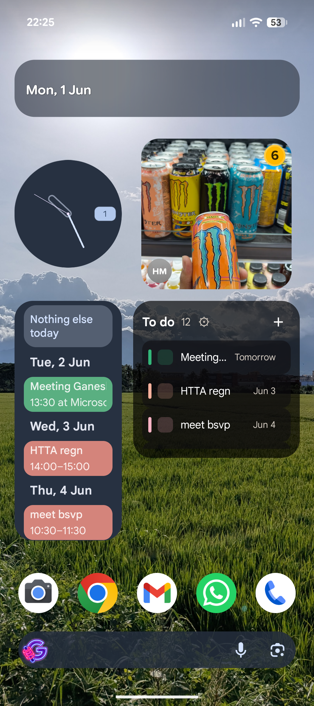
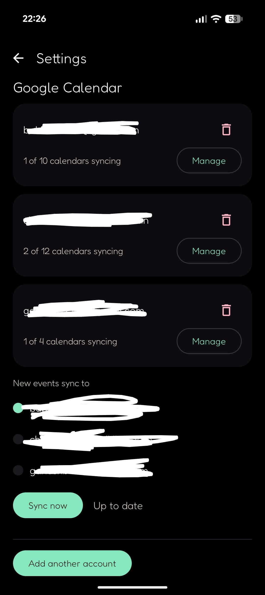
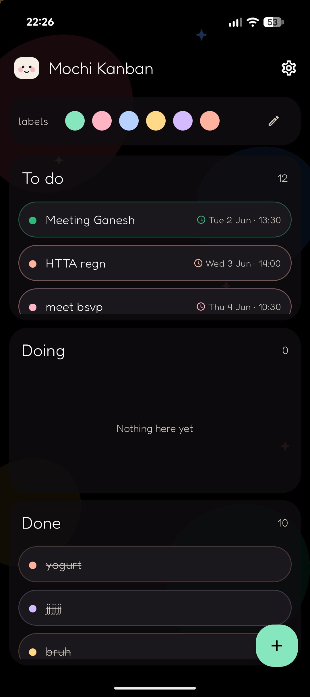

# 🍡 Mochi Kanban

A kawaii, open-source Android kanban board with two-way Google
Calendar sync. Usual Kanban To do → Doing → Done decks, dated events stay in
sync with your gcalendar, and a home-screen widget keeps today's list a tap away.
Reminders fire with Complete/Snooze, and you can type dates right into a title
("lunch tomorrow 15:00") and they're parsed automatically.

<p align="center">
  
  
  
</p>

## Install

Download the latest signed APK from the
[Releases page](https://github.com/gnshb/mochi-kanban/releases).

## Google sign-in

The prebuilt APK's Google sign-in only works for accounts I've added as **test
users** — this is a Google restriction: an OAuth app with the sensitive Calendar
scope can't be used by arbitrary accounts until it passes Google's verification.

If you want Calendar sync on your own account, **build from source with your own
OAuth Web client ID** (see below). Everything except Calendar sync works without
any of this.

## Build from source

Requirements: JDK 17, Android SDK with platform 35 and build-tools.

```sh
git clone https://github.com/gnshb/mochi-kanban.git
cd mochi-kanban
./gradlew :app:assembleDebug          # debug APK
./gradlew :app:testDebugUnitTest      # unit tests
./gradlew :app:assembleRelease        # minified release APK
```

Google Calendar sync is optional. Add a **Web** OAuth client ID to
`local.properties` as `GOOGLE_OAUTH_CLIENT_ID=...`; without it the app runs as a
local-only board. Release signing reads `keystore.properties` (see
`keystore.properties.example`) or the `MOCHI_RELEASE_*` environment variables.

## Changelog

### v0.1.4

- Restored stable card/widget sizing for action-required tasks: the state is just a red glow.
- Hid scheduled cards whose end time is before today so stale calendar cards do not return to To do.

### v0.1.3

- Kept overdue timed tasks in To do with an action-required warning instead of auto-completing them.
- Added active/overdue glows in the app and widget, with targeted widget clock refreshes.
- Switched label colors and Google event color sync to exact Calendar color IDs instead of nearest matches.

### v0.1.2

- Fixed duplicate calendar events from rapid edits before the first sync.
- All-day calendar events now resolve to local 00:00.

### v0.1.1

- Reworked the widget for reliability: instant complete, awaited refresh after every change, and a working background-opacity control.
- Strikethrough now follows the clock-driven column, so finished dated events read as done.
- New events default to a 1-hour window and no longer add Google's default reminder.
- Reminders show a Complete/Snooze heads-up; Snooze reschedules the event back to To do.
- Natural-language date parsing in titles (today/tomorrow/weekdays, "in N days", month-name and numeric dates, 24h times); Done clears nightly.

### v0.1.0

- Initial release.

## License

GPL v3. See [LICENSE](LICENSE).
